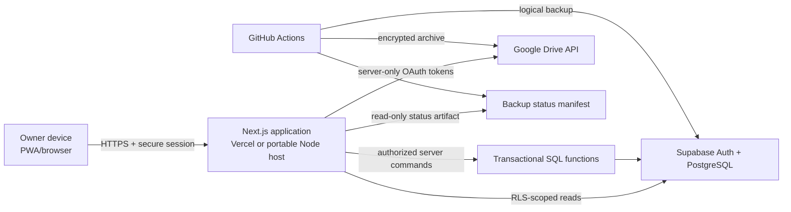
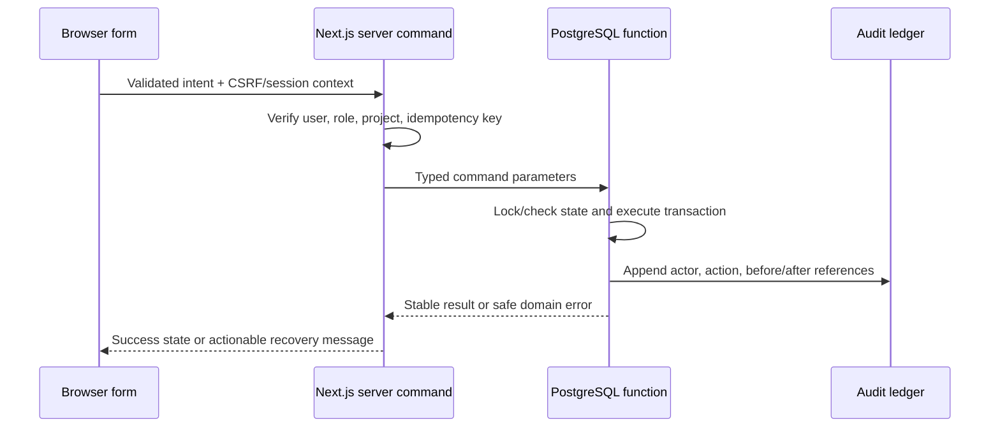

# Architecture

Status: initial architecture
Last updated: 2026-08-14

## System shape

The application is a Next.js App Router project using React Server Components by default. Browser reads use a publishable Supabase client scoped by RLS when this improves responsiveness. Server Components, route handlers, and server actions use cookie-backed sessions. Privileged or multi-table writes pass through server authorization and transactional PostgreSQL functions.

## Layer responsibilities

### Browser interface

- Responsive presentation, accessible controls, forms, local view state, and optimistic affordances only where safe.
- No service-role key, OAuth secret, refresh token, encryption key, or privileged database URL.
- No authoritative money or stock calculation beyond display formatting and pre-submit feedback.

### Next.js server

- Session verification, owner allowlist enforcement, project authorization, input validation, rate limiting, safe errors, integration orchestration, report generation, and token encryption/decryption.
- Commands expose specific use cases rather than a generic data mutation endpoint.

### PostgreSQL

- Source of truth for relational state, status constraints, uniqueness, exact arithmetic, audit metadata, calculation views/functions, RLS, and atomic finance/inventory posting.
- `SECURITY DEFINER` is exceptional, uses a fixed safe `search_path`, checks the caller and project membership, and receives focused tests.

### Google Drive integration

- Separate least-privilege `drive.file` authorization from basic Google sign-in.
- Refresh tokens are encrypted at rest and handled only server-side.
- Database records store file IDs and integrity metadata, not public URLs.

### Reporting

- Queries versioned deterministic read models.
- A normalized report result feeds PDF, XLSX, and CSV renderers so formats agree.
- Saved reports receive history records and optional explicit Drive upload.

### Backup automation

- GitHub Actions exports roles/schema/data, validates outputs, writes a manifest/checksum, encrypts with a public recipient, uploads recognized archives, and publishes a non-secret status manifest.
- Private decryption material stays outside GitHub and the application.

### Future AI provider boundary

- Disabled feature flag and provider interface.
- AI can propose drafts or explanations but cannot post payments, stock, or authoritative totals.
- Natural-language analytics may call curated read-only database functions only.

## Data flow for a critical write

## Authentication and authorization

- Supabase Auth handles Google identity; authorization is application-owned.
- `profiles`, `project_memberships`, and explicit roles determine access.
- Production owner sign-in is admitted only when the normalized email is in the configured allowlist and project membership exists.
- RLS uses the authenticated subject and membership records for reads/writes. Server code still checks authorization to provide defense in depth and clearer errors.
- Preview deployments use development configuration and are never permitted to point to production by default.

## Reliability and slow connections

- Server-render the useful shell and initial read models.
- Reserve space for asynchronous content and use skeletons for waits longer than roughly 300 ms.
- Retry safe idempotent reads; critical writes use idempotency keys and clear unknown-outcome recovery.
- Cache the application shell and selected read-only responses for PWA resilience. Never queue finance or inventory writes offline in the first release.

## Portability

- Business logic is TypeScript and PostgreSQL, not Vercel-only proprietary services.
- Deployment supports a standard Node.js host; Drive integration is behind an interface.
- SQL migrations, functions, policies, seed/reference data, report templates, and backup/restore scripts live in the repository.

## Technology baseline

Verified 2026-08-14 against official documentation and the npm registry:

- Next.js 16.3.1, React 19.2.8, App Router; Node.js 20.9+ is required by current Next.js documentation.
- Tailwind CSS 4.3.3 through `@tailwindcss/postcss`.
- Supabase JS 2.112.3 and `@supabase/ssr` 0.12.4 for cookie-based Next.js sessions.
- Zod, React Hook Form, Recharts, Lucide, Vitest, and Playwright are planned maintained dependencies; the lockfile is authoritative.

Sources: https://nextjs.org/docs/app/getting-started/installation, https://tailwindcss.com/docs/installation/framework-guides/nextjs, https://supabase.com/docs/guides/auth/choosing-a-server-package, https://ui.shadcn.com/docs/installation/next
