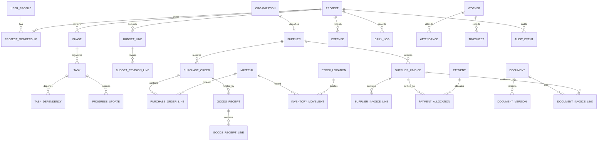

# Initial database design

Status: foundation migrated and tested; business-module migrations continue in Phase 2
Last updated: 2026-08-14

## Design principles

- UUID primary keys; human references come from transaction-safe per-project/year sequences.
- `timestamptz` for events and audit times; project-local dates remain explicit where needed.
- ISO currency code plus PostgreSQL `numeric` for all money. No floating point.
- Soft archive for ordinary master data; posted ledgers use reversal links and immutable posting fields.
- `project_id` is explicit on project-owned records to support indexing and legible RLS.
- Foreign keys and focused link tables preserve referential integrity; avoid unvalidated polymorphic links.
- Status values are constrained and transitions occur through tested commands/functions.

## Relationship overview

## Planned schema groups

### Identity and administration

`profiles`, `application_roles`, `project_memberships`, `project_settings`, `currencies`, `units_of_measure`, `number_sequences`, `audit_events`, `idempotency_keys`.

### Project delivery

`projects`, `phases`, `tasks`, `task_dependencies`, `milestones`, `progress_updates`, `progress_measurements`, `change_orders`, `change_order_lines`.

### Contacts and workforce

`organizations`, `contacts`, `organization_contacts`, `suppliers`, `contractors`, `workers`, `attendance`, `timesheets`.

### Finance

`budget_categories`, `budget_lines`, `budget_revisions`, `budget_revision_lines`, `expenses`, `supplier_invoices`, `supplier_invoice_lines`, `credit_notes`, `payments`, `payment_allocations`, `payment_methods`, `financial_periods`.

### Procurement and stock

`quotations`, `quotation_lines`, `purchase_orders`, `purchase_order_lines`, `purchase_order_approvals`, `deliveries`, `goods_receipts`, `goods_receipt_lines`, `supplier_returns`, `supplier_return_lines`, `material_categories`, `materials`, `stock_locations`, `inventory_movements`, `inventory_transfer_groups`, `reorder_levels`.

### Site, documents, reports, operations

`daily_logs`, `daily_log_workers`, `daily_log_materials`, `daily_log_equipment`, `delays`, `incidents`, `inspections`, `defects`, `corrective_actions`, `documents`, `document_versions`, explicit document link tables, `report_definitions`, `report_runs`, `export_history`, `notification_history`, `backup_status`, `application_events`.

## Ledger behavior

### Inventory

`inventory_movements` is append-only after posting. Each row includes material, location, signed quantity, unit, movement type, effective date, source reference, reversal reference, actor, and posting timestamp. Current stock is the sum of posted, non-void movement quantities grouped by project/material/location. Transfers create linked negative and positive entries atomically.

### Finance

- Committed cost: approved/issued purchase commitments, adjusted for approved cancellation and defined change orders.
- Actual cost: posted expenses and supplier invoice amounts under the documented accounting policy, net of credit/reversal entries.
- Paid: posted payments allocated or directly classified to the project.
- Remaining budget: current approved budget minus actual cost by default; dashboard definitions will display the exact formula and may also expose budget less forecast.
- Forecast final: actual plus remaining forecast, with commitments shown independently to avoid double counting.

These definitions will be formalized as versioned SQL views/functions and tested before dashboard figures are connected.

## RLS approach

Every exposed project table enables RLS. Policies check `auth.uid()` against active project membership and the minimum role required for the operation. Tables containing integration secrets are never directly exposed. Sensitive operations use narrow server/database functions with explicit membership checks and safe `search_path` settings.

## Implemented foundation

Migration `20260814180000_foundation_identity_and_projects.sql` now implements profiles, application roles, projects, project settings, memberships, ZMW/USD reference currencies, units, number sequences, append-only audit events, and idempotency keys. The private owner allowlist is isolated from the exposed schema. Project creation is an authenticated, idempotent database command that atomically creates the project, Africa/Lusaka and ZMW defaults, owner membership, and audit evidence.

All exposed foundation tables have forced RLS. Direct table mutation is revoked, project reads require active membership, and 20 pgTAP tests cover owner admission, defaults, isolation, read-only restrictions, idempotency, and audit immutability.

## Migration sequence

1. Extensions, enums/domains, and shared helpers. **Implemented for the foundation.**
2. Profiles, projects, memberships, settings, and reference data. **Implemented.**
3. Audit and idempotency foundations. **Implemented.**
4. Project, finance, procurement, inventory, workforce, and document tables in dependency order.
5. Transactional posting functions and calculation views.
6. RLS policies, grants, indexes, and database tests.
